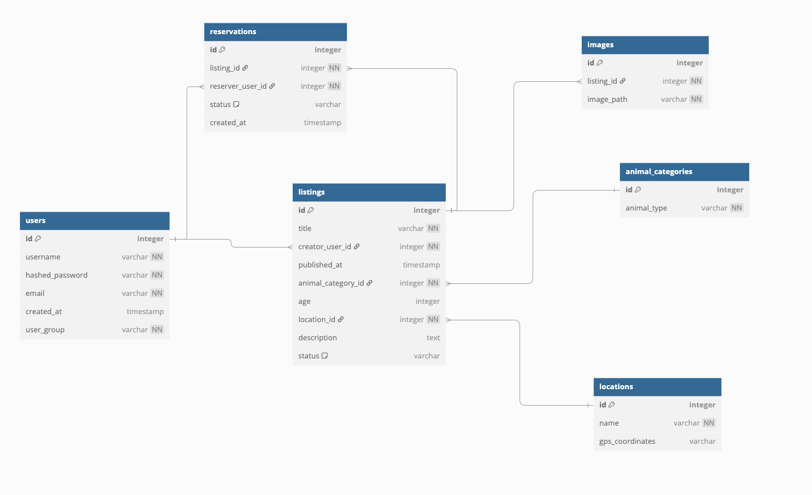

# Pupilove
Aplikacja to platforma ogłoszeniowa dla schronisk i użytkowników indywidualnych, umożliwiająca dodawanie, edycję oraz usuwanie ogłoszeń o zwierzętach do adopcji. Użytkownicy mogą przeglądać dostępne zwierzęta, filtrować ogłoszenia oraz kontaktować się z opiekunami w celu adopcji.
## Przypadki użycia aplikacji
-   **Rejestracja i logowanie użytkownika** – użytkownik rejestruje się, loguje i zarządza swoim kontem.
-   **Dodawanie ogłoszeń o adopcji** – zalogowany użytkownik może dodać ogłoszenie o zwierzaku do adopcji.
-   **Edycja i usuwanie ogłoszeń** – użytkownik może modyfikować swoje ogłoszenia lub je usuwać, gdy zwierzę zostanie adoptowane.
-   **Przeglądanie ogłoszeń** – wszyscy użytkownicy (w tym niezalogowani) mogą przeglądać listę dostępnych zwierząt.
-   **Filtrowanie i wyszukiwanie ogłoszeń** – możliwość wyszukiwania zwierząt według różnych kryteriów (gatunek, wiek, lokalizacja).
-   **Kontakt w sprawie adopcji** – użytkownik może wysłać zapytanie o adopcję do autora ogłoszenia.
## Scenariusz wysokiego obciążenia
-   Pojawia się ogłoszenie o bardzo popularnym zwierzaku (np. rzadkiej rasy psa).
-   Wielu użytkowników odwiedza stronę ogłoszenia jednocześnie, co prowadzi do dużej liczby zapytań **SELECT** do bazy danych.
## Propozycja rozwiązania
**Percona XtraDB Cluster + ProxySQL**
-   **Percona XtraDB Cluster** zapewni replikację i wysoką dostępność bazy, eliminując pojedynczy punkt awarii.
-   **ProxySQL** pozwoli rozłożyć ruch na wiele node'ów.
## Model bazy danych

